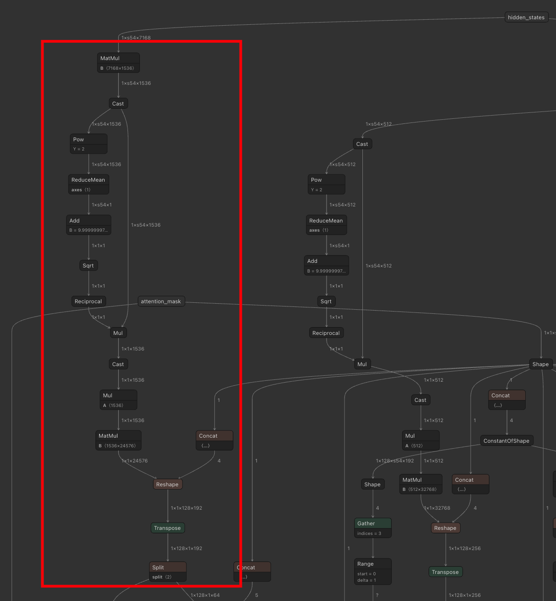
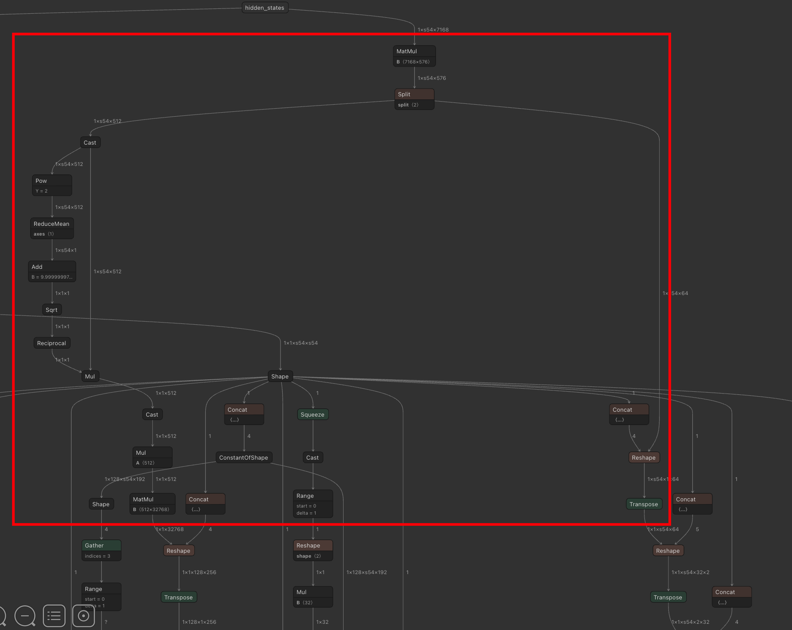
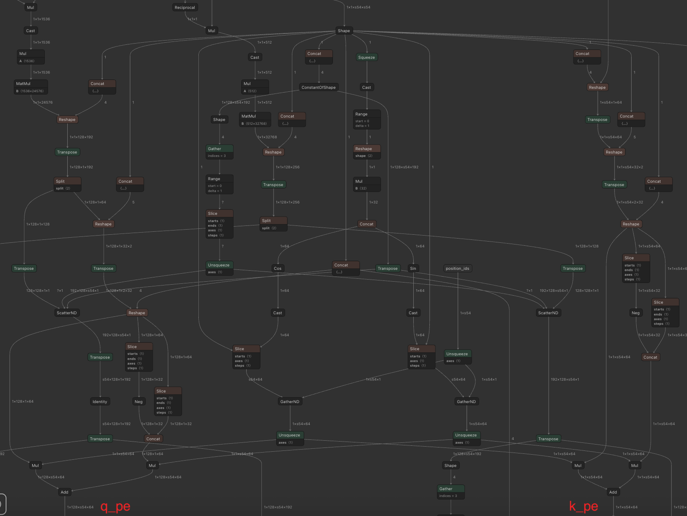

# 0.前言
本文章由Gemini协助创作.


# 1.MLA()
先查看源代码实现
[vllm/model_executor/models/deepseek_v2.py:](https://github.com/vllm-project/vllm/blob/72506c98349d6bcd32b4e33eec7b5513453c1502/vllm/model_executor/models/deepseek_v2.py#L526-L570)
```python
def forward(
    self,
    positions: torch.Tensor,
    hidden_states: torch.Tensor,
    llama_4_scaling: torch.Tensor | None,
) -> torch.Tensor:
    if self.q_lora_rank is not None:
        q = self.q_a_proj(hidden_states)[0]
        q = self.q_a_layernorm(q)
        q = self.q_b_proj(q)[0].view(-1, self.num_local_heads, self.qk_head_dim)
    else:
        q = self.q_proj(hidden_states)[0].view(
            -1, self.num_local_heads, self.qk_head_dim
        )
    q_nope, q_pe = q.split([self.qk_nope_head_dim, self.qk_rope_head_dim], dim=-1)
    latent_cache = self.kv_a_proj_with_mqa(hidden_states)[0]
    kv_a, _ = latent_cache.split([self.kv_lora_rank, self.qk_rope_head_dim], dim=-1)
    latent_cache = latent_cache.unsqueeze(1)
    kv_a = self.kv_a_layernorm(kv_a)
    kv = self.kv_b_proj(kv_a)[0]
    kv = kv.view(-1, self.num_local_heads, self.qk_nope_head_dim + self.v_head_dim)
    k_nope, v = kv.split([self.qk_nope_head_dim, self.v_head_dim], dim=-1)
    k_pe = latent_cache[:, :, self.kv_lora_rank :]

    q_pe, k_pe = self.rotary_emb(positions, q_pe, k_pe)

    q[..., self.qk_nope_head_dim :] = q_pe
    k = torch.empty_like(q)
    k[..., : self.qk_nope_head_dim] = k_nope
    k[..., self.qk_nope_head_dim :] = k_pe

    # Apply llama 4 scaling if provided
    if llama_4_scaling is not None:
        q *= llama_4_scaling

    # padding value to qk_head_dim for alignment
    v = torch.nn.functional.pad(
        v, [0, self.qk_head_dim - self.v_head_dim], value=0
    ).view(-1, self.num_local_heads * self.qk_head_dim)
    attn_output = self.attn(q, k, v)
    attn_output = attn_output.view(-1, self.num_local_heads, self.qk_head_dim)[
        ..., : self.v_head_dim
    ].reshape(-1, self.num_local_heads * self.v_head_dim)
    output, _ = self.o_proj(attn_output)
    return output
```

## 1.1 Query (Q) 的生成与压缩
MLA允许对Q进行低秩压缩（Low-Rank Compression）以减少参数量。DeepSeek的一个创新点是将Query向量拆分为两部分：一部分携带内容信息，另一部分携带位置信息。
```python
if self.q_lora_rank is not None:
    # 路径 A: Q 的低秩压缩模式
    q = self.q_a_proj(hidden_states)[0]  # 降维 (压缩)
    q = self.q_a_layernorm(q)            # LayerNorm
    q = self.q_b_proj(q)[0].view(-1, self.num_local_heads, self.qk_head_dim) # 升维 (解压)
else:
    # 路径 B: 标准的全连接层投影
    q = self.q_proj(hidden_states)[0].view(
        -1, self.num_local_heads, self.qk_head_dim
    )
# 将 Q 拆分为两部分：
# q_nope: Non-RoPE (不加旋转位置编码的部分，主要负责内容匹配)
# q_pe:   RoPE (加旋转位置编码的部分，主要负责位置关系)
q_nope, q_pe = q.split([self.qk_nope_head_dim, self.qk_rope_head_dim], dim=-1)
```
在onnx中对应红框部分：

其中`q_a_proj`和`q_b_proj`是两个matmul.

|计算|input|weight|output|含义|
|----|----|----|----|----|
|`q_a_proj`|`[batch_size, sequence_length, d_model(7168)]`|`[d_model(7168), q_lora_rank(1536)]`|`[batch_size, sequence_length, q_lora_rank(1536)]`|特征维度从7168压缩到1536|
|`q_b_proj`|`[batch_size, sequence_length, q_lora_rank(1536)]`|`[q_lora_rank(1536), num_local_heads*qk_head_dim(128*192=24576)]`|`[batch_size, sequence_length, num_local_heads*qk_head_dim(128*192=24576)]`|将压缩后的 1536 维特征“解压”还原为 128 个头所需的全部信息|

之后的`q_a_layernorm`是RMSNorm (Root Mean Square Layer Normalization), 计算公式为
$$
y_i = \frac{x_i}{\sqrt{\frac{1}{d} \sum_{j=1}^{d} x_j^2 + \epsilon}} \cdot \gamma_i
$$
在onnx中, 在计算是RMSNorm前先cast到了fp32计算, 完成后转换回bf16.
对应`Cast->Pow->ReduceMean->Add->Sqrt->Reciprocal->Mul->Cast`.


## 1.2 Key-Value (KV) 的生成 (MLA核心)

```python
# 1. 压缩：将 hidden_states 投影到一个低维的潜在空间 (Latent Space)
latent_cache = self.kv_a_proj_with_mqa(hidden_states)[0]

# 2. 拆分：从潜在向量中分出两部分
# kv_a: 用于生成内容相关的 Key 和全部 Value 的压缩向量
# _:    这里切分出的第二部分，实际上是 k_pe (RoPE Key)，后面代码有体现
kv_a, _ = latent_cache.split([self.kv_lora_rank, self.qk_rope_head_dim], dim=-1)

# ... 维度调整 ...
latent_cache = latent_cache.unsqueeze(1) 

# 3. 生成 KV 的内容部分 (Up-Projection)
kv_a = self.kv_a_layernorm(kv_a)
kv = self.kv_b_proj(kv_a)[0] # 从压缩的 kv_a 还原出高维数据

# 4. 再次拆分 KV
# k_nope: Key 的内容部分 (不加 RoPE)
# v:      完整的 Value 向量
kv = kv.view(-1, self.num_local_heads, self.qk_nope_head_dim + self.v_head_dim)
k_nope, v = kv.split([self.qk_nope_head_dim, self.v_head_dim], dim=-1)

# 5. 提取 Key 的位置部分
# k_pe 是直接从 latent_cache 的尾部拿出来的，它绕过了 kv_b_proj 的复杂计算
k_pe = latent_cache[:, :, self.kv_lora_rank :]
```
对应onnx的红框部分
这里的`kv_a_proj_with_mqa, kv_b_proj`都是gemm, `kv_a_layernorm`是RMSNorm, 不多做赘述.

## 1.3 应用旋转位置编码 (RoPE)
```python
q_pe, k_pe = self.rotary_emb(positions, q_pe, k_pe)
```

以`q_pe`为例, RoPE实际在计算:
$$
\begin{pmatrix} 
q\_pe'_{2i} \\ 
q\_pe'_{2i+1} 
\end{pmatrix} = 
\begin{pmatrix} 
\cos(\text{positions} \cdot \theta_i) & -\sin(\text{positions} \cdot \theta_i) \\ 
\sin(\text{positions} \cdot \theta_i) & \cos(\text{positions} \cdot \theta_i) 
\end{pmatrix} 
\begin{pmatrix} 
q\_pe_{2i} \\ 
q\_pe_{2i+1} 
\end{pmatrix}
$$
展开后为:
$$
k\_pe'_{2i} = k\_pe_{2i} \cos(\text{positions} \cdot \theta_i) - k\_pe_{2i+1} \sin(\text{positions} \cdot \theta_i) \\
k\_pe'_{2i+1} = k\_pe_{2i} \sin(\text{positions} \cdot \theta_i) + k\_pe_{2i+1} \cos(\text{positions} \cdot \theta_i)
$$
实际计算时, 做分半配对, 即将偶数和奇数位分别连续排列`0, 2, ..., 2i, 1, 3, ..., 2i+1`, 这样在计算时, 就是前半部分计算减法, 后半部分计算加法.

## 1.4 重组 Query 和 Key, 缩放与对齐 (Padding)
现在我们将处理好的各部分拼回去, 准备进行注意力计算.
```python
# 更新 Q：将旋转后的 q_pe 填回
q[..., self.qk_nope_head_dim :] = q_pe

# 重组 K：
k = torch.empty_like(q)
k[..., : self.qk_nope_head_dim] = k_nope   # 前半部分是内容 Key (无 RoPE)
k[..., self.qk_nope_head_dim :] = k_pe     # 后半部分是位置 Key (有 RoPE)


if llama_4_scaling is not None:
    q *= llama_4_scaling

# Padding V (对齐技巧)
# 为了让 Attention 计算核 (如 FlashAttention) 效率最高，
# 通常要求 Q, K, V 的 head_dim 相同。
# 这里 V 的维度 (v_head_dim) 可能比 Q/K 小，所以补 0 对齐。
v = torch.nn.functional.pad(
    v, [0, self.qk_head_dim - self.v_head_dim], value=0
).view(-1, self.num_local_heads * self.qk_head_dim)
```

## 1.5 注意力计算与输出
```python
# 计算 Attention Score: Softmax(Q @ K.T / scale) @ V
attn_output = self.attn(q, k, v)

# 切片 (Slice)
# 之前为了计算对齐给 V 补了 0，现在要把这部分无效数据切掉，只保留有效的 v_head_dim
attn_output = attn_output.view(-1, self.num_local_heads, self.qk_head_dim)[
    ..., : self.v_head_dim
].reshape(-1, self.num_local_heads * self.v_head_dim)

# 最终输出投影
output, _ = self.o_proj(attn_output)
return output

```
